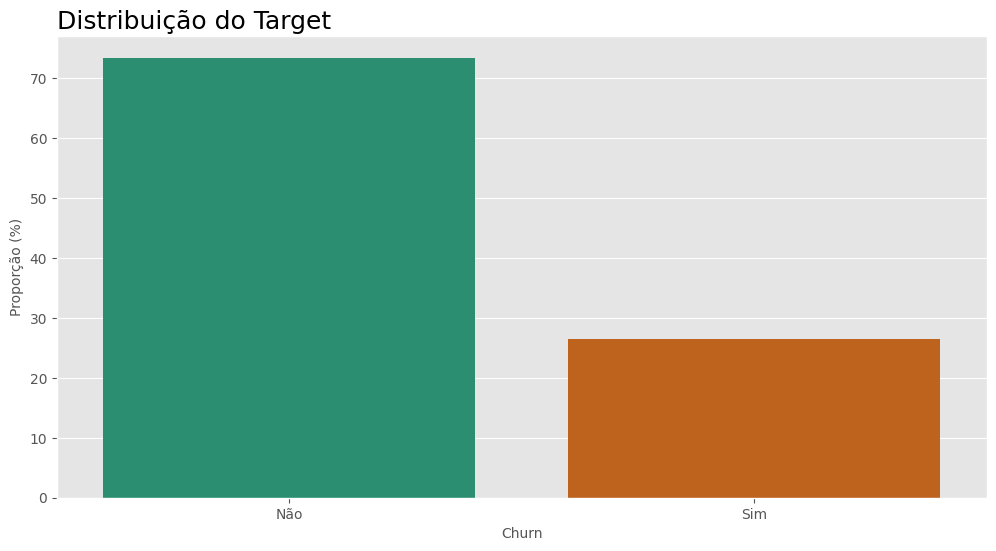
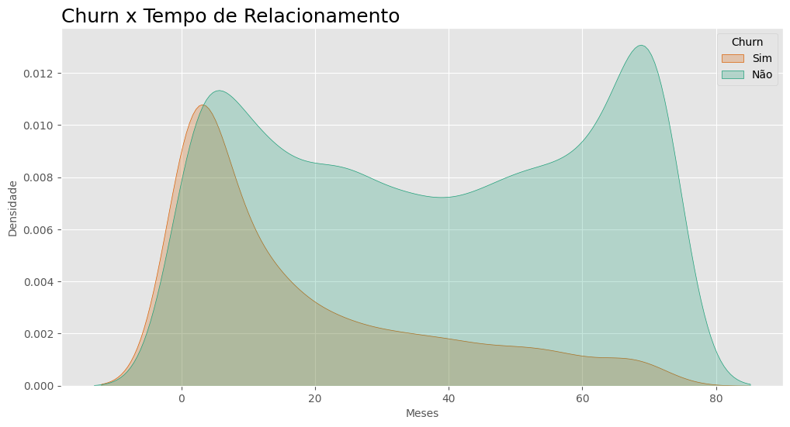
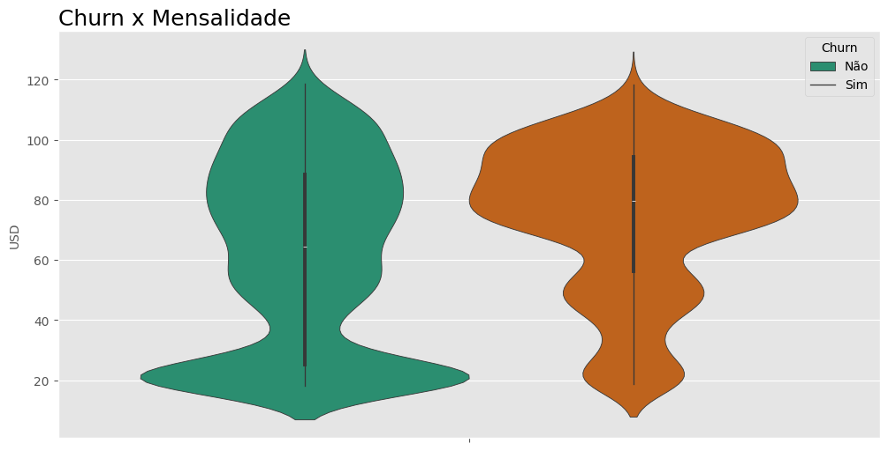
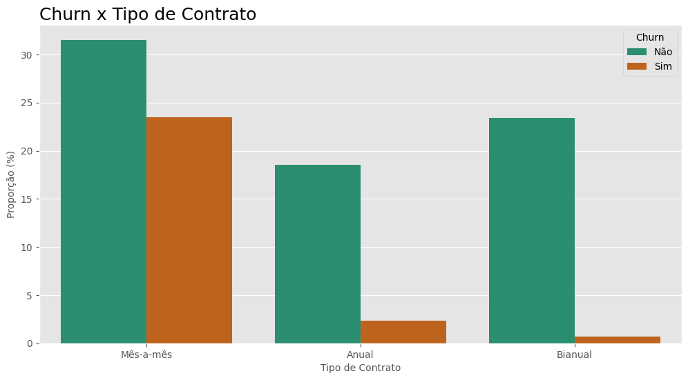
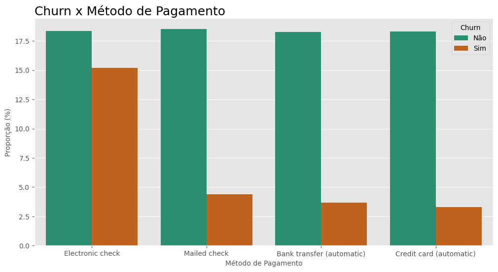

# Análise e Predição de Churn em uma Telecom

## Conteúdo

- [Introdução](#introdução)
- [Metas e objetivos](#metas-e-objetivos)
- [Dados](#dados)
- [Métodos e modelos](#métodos-e-modelos)
- [Resultados](#resultados)
- [Ferramentas utilizadas](#ferramentas-utilizadas)

## Introdução
O dataset Telco Customer Churn contêm informações sobre uma empresa fictícia de telecomunicações que forneceu serviços de telefone residencial e Internet para 7043 clientes na Califórnia no terceiro trimestre. Eles indicam quais clientes deixaram, permaneceram ou se inscreveram para os seus serviços.

- **Veja o projeto completo**: [Github](https://github.com/datalopes1/telco_pred_churn)
- **Faça Predições com o Aplicativo Web:** [Streamlit](https://telcochurn-predictor.streamlit.app/).

## Metas e objetivos
O objetivo deste projeto é (1) explorar os dados em busca de insights sobre a taxa de Churn da Telco, e (2) construir um modelo de machine learning capaz de predizer clientes que darão churn.

## Dados

|Coluna|Descrição|
|---|---|
|`customerID`|Identificador único dos clientes|
|`gender`|Gênero|
|`SeniorCitizen`|É idoso?|
|`Partner`|Possui parceiro?|
|`Dependents`|Possui dependentes?|
|`tenure`|Tempo de relacionamento (em meses)|
|`PhoneService`|Possui serviço telefonico?|
|`MultipleLines`|Possui multiplas linhas?(Sim, não, não possui serviço telefonico)|
|`InternetService`|Provedor de serviços de internet (DSL, Fibra ou não)|
|`OnlineSecurity`|Possui seguro online?|
|`OnlineBackup`|Possui backup online?|
|`DeviceProtection`|Possui proteção do dispositivo?|
|`TechSupport`|Tem suporte técnico?|
|`StreamingTV`|Possui streaming de TV?|
|`StreamingMovies`|Possui streaming de Filmes?|
|`Contract`|Tipo de contrato(mês-a-mês, anual ou bi-anual)|
|`PaperlessBilling`|Recebe boletos?|
|`PaymentMethod`|Método de pagamento|
|`MonthlyCharges`|Taxa de serviço|
|`TotalCharges`|Total pago pelo cliente|
|`Churn`|Alvo|

Os dados podem ser encontrados no [Kaggle](https://www.kaggle.com/datasets/blastchar/telco-customer-churn/data) e foram disponibilizados por BlastChar.

## Métodos e modelos

#### Pré-processamento e otimizações
- Scikit-learn, Optuna, Category Encoders, Feature Engine.

#### Modelos
- RandomForest, CatBoost.

#### Métricas de avaliação
- Acurácia, F1 Score, ROC AUC e MCC.

## Análise Exploratória de Dados
**Cálculos dos Testes e construção dos gráficos:** [Jupyter Notebook](https://github.com/datalopes1/telco_pred_churn/blob/main/notebooks/notebook.ipynb)

### Comportamento do target

A média da taxa de Churn no mercado de telefonia é entre 3% e 5%, a Telco possui uma taxa altíssima em comparação com outras empresas.

### Explorando hipóteses
#### Churn x Tempo de Relacionamento
Quanto mais tempo permanecemos consumindo um serviços, muitas vezes por apego ou comodidade evitamos seu cancelamento. Em inicio de contrato o comportamento de estar atento e menos paciente com erros é comum, vamos trabalhar em cima da seguinte hipótese:

- $H_0:$ O tempo de relacionamento com a empresa não tem efeito significativo na probabilidade de churn.
- H1 Pessoas com menor tempo de relacionamento com a empresa têm maior probabilidade de churn.

Rejeitamos H0: Clientes com menor tempo de relacionamento com a empresa tem maior probabilidade de churn.

#### Churn x Mensalidade

Pagar mais caro em um serviço é algo que também vai elevar o nível de exigência e diminuir o de paciência, vamos trabalhar na seguinte hipótese:

- $H_0:$ O valor da mensalidade não tem efeito significativo na probabilidade de churn.
- H1: Clientes que pagam maiores mensalidades têm maior probabilidade de churn.

Rejeitamos H0: Clientes que pagam maiores mensalidades têm maior probabilidade de churn.

#### Churn x Tipo de Contrato
A forma de contrato também pode estar ligada a probabilidade de Churn, vamos trabalhar também nessa hipótese:

- H0: Churn é independente do Tipo de Contrato.
- H1 Churn não é independente do Tipo de Contrato.

Rejeitamos H0: Churn não é independente do Tipo de Contrato.

#### Churn x Método de Pagamento
A forma de pagamento também é outra variável que pode influenciar na probabilidade de Churn, vamos trabalhar essa hipótese:

- $H_0:$ Churn é independente do Método de Pagamento.
- H1 Churn não é independente do Método de Pagamento.

$H_0:$ Churn não é independente do Método de Pagamento.

## Resultados
### Conclusões da Análise Exploratória
- Clientes com menor tempo de relacionamento com a Telco tem maior probabilidade de Churn, são necessárias ações para aumentar a fidelização de clientes novos, especialmente no recorte dos primeiros 18 meses;
- Pessoas em planos com mensalidade maior tem maior probabilidade de Churn, é necessário checar o atendimento nestes planos e revisar os preços;
- Planos mensais são aquele com maior taxa de Churn, gerar incetivos para assinatura de planos mais longos pode ser uma solução;
- Pessoas adeptas de planos de pagamento automáticos tem uma probabilidade significamente menor de Churn, é interessante incentivar sua assinatura.

**Insights pós-análise:** É possível criar um plano de ação em forma de campanhas de marketing e novos planos de serviço para diminuir a taxa de Churn na Telco, algumas opções seriam (1) oferecer um plano anual com desconto caso o meio de pagamento escolhido seja Bank transnfer ou Credit card, (2) revisar preço e dar descontos para clientes com mais tempo de relacionamento que possuem planos mais caros para renovação anual ou bianual.

### Métricas do modelo

**Construção do modelo:** [Jupyter Notebook](https://github.com/datalopes1/telco_pred_churn/blob/main/notebooks/notebook.ipynb)

|Métrica|Resultado|
|---|---|
|**Acurácia**|0.7786|
|**F1 Score**|0.6502|
|**ROC AUC**|0.8585|
|**MCC**|0.5089|

### Visualizações

## Ferramentas utilizadas

## Contatos
- **E-mail:** andreluizlcons@gmail.com
- **LinkedIn:** https://www.linkedin.com/in/andreluizls1/
- **Telefone:** +55 88999934237